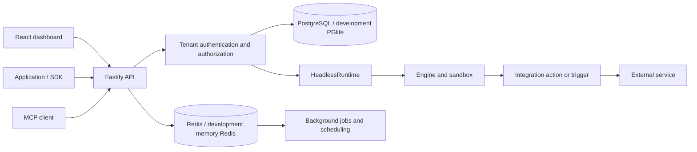

# Inboxfm Connect architecture

Inboxfm Connect is a headless fork of Activepieces. The web dashboard manages integrations, connections, API keys, and MCP servers; it does not include the upstream visual flow builder. This guide describes current module boundaries rather than promising that all inherited functionality has been removed.

## System overview

The public execution entry point is `packages/server/api/src/app/execute/execute.controller.ts`, which invokes `HeadlessRuntime` from `@inboxfm-connect/runtime`. Execution mode determines how the engine isolates work. `UNSANDBOXED` is for trusted development; a local demo is not evidence of production isolation.

## Package map

| Package directory | Responsibility |
| --- | --- |
| `packages/server/api` | Fastify routes, authentication, authorization, repositories, migrations, and background work |
| `packages/runtime` | Headless runtime orchestration and its host callbacks |
| `packages/server/engine` | Integration loading, input processing, action execution, and runtime behavior |
| `packages/server/sandbox` | Isolation and sandbox infrastructure |
| `packages/server/utils` | Server utilities, safe outbound HTTP, logging, connection budgets |
| `packages/core/utils` | Thin identifiers, errors, and general utilities |
| `packages/core/piece-types` | Thin integration contracts and schemas |
| `packages/core/formula` | Formula processing |
| `packages/core/execution` | Thin execution contracts and helpers |
| `packages/core/shared` | Thick application, database, management, and inherited EE schemas |
| `packages/integrations/framework` | Integration authoring API |
| `packages/integrations/common` | Integration HTTP, authentication, polling, and other shared helpers |
| `packages/integrations/core` and `community` | Core and third-party integration packages |
| `packages/scheduler` | Cron and scheduling utilities |
| `packages/web` | React/Vite application |
| `packages/connect-sdk` | Public TypeScript client, generated types, examples, and package verification |
| `packages/cli` | Integration development commands |
| `packages/ee` and `packages/server/api/src/app/ee` | Inherited Enterprise-licensed material; see licensing limitations below |

Integration and engine code may import the thin core members through the integration framework. They must not acquire dependencies on `@inboxfm-connect/shared`, the API, or the Enterprise implementation.

## Request and execution lifecycle

1. Fastify validates the request and applies its `securityAccess` policy.
2. Authentication establishes a principal; authorization checks its project/platform scope.
3. The execute controller resolves the integration and the caller's connection.
4. The runtime uses host callbacks to retrieve credentials and refresh/decrypt the connection, then dispatches the action to the engine.
5. The action calls its external service and returns structured data. Runtime failures are translated into the API's error contract.

SDK clients use the same HTTP boundary as other callers. Connect sessions let end users authorize a connection; a project-scoped Connect API key must not authorize another project's resources. MCP exposes available tools and schemas to compatible clients through the API's MCP module.

## Data ownership and persistence

The tenant hierarchy is **platform → projects → users/memberships**. Connection access, tables, API keys, sessions, executions, and other project resources must be scoped explicitly. A globally unique ID is not an authorization check.

TypeORM entities are registered explicitly in `packages/server/api/src/app/database/database-connection.ts` through `getEntities()`. There is no automatic entity discovery. Persistent model changes require migrations and must preserve isolation.

Development can use PGlite; production-oriented configuration uses PostgreSQL and Redis. PGlite testing mode synchronizes an in-memory schema, while migration checks exercise the migration path separately. The dedicated PostgreSQL CI suite catches driver behavior that an embedded test database can miss. Tool search's vector-backed path requires pgvector; ordinary development tests load PGlite's vector extension.

Redis supports queues, scheduled jobs, locks, and cache coordination. Concurrent work across servers must use distributed locks, BullMQ deduplication, or transactional database claiming such as `FOR UPDATE SKIP LOCKED`.

## Modules to read first

| Change | Starting point |
| --- | --- |
| Execute an integration action | `packages/server/api/src/app/execute`, `packages/runtime` |
| Embedded connection flow | `connect-api-keys`, `connect-oauth-apps`, `connect-sessions` under the API app |
| MCP endpoints | `packages/server/api/src/app/mcp` |
| Credentials and refresh | `packages/server/api/src/app/app-connection` |
| Tables and records | `packages/server/api/src/app/tables` |
| Tool index | `packages/server/api/src/app/tool-search` |
| Request security | `packages/server/api/src/app/core/security` |
| Database entities and migrations | `packages/server/api/src/app/database` |
| Dashboard behavior | `packages/web/src` |
| Client contracts | `packages/connect-sdk`, `docs/connect-sdk` |

Read the relevant `.agents/features/*.md`, package `AGENTS.md`, and `.claude/rules/` before implementation. Some inherited feature notes are marked stale; current source and tests take precedence.

## Edition and licensing boundary

The source still supports `ce`, `ee`, and `cloud` branches and contains imports from Enterprise directories, including at application registration and database boundaries. New code must not expand that dependency. Hooks provide extension points where possible, and backend feature middleware/frontend guards enforce plan access.

**Edition or feature gates do not change copyright or grant license rights.** Existing Enterprise dependencies and modifications mean this repository must not be described as entirely MIT or cleared for unrestricted production redistribution. Preserve license notices and read [LICENSING.md](LICENSING.md). The planned removal of Enterprise implementation is tracked in [#25](https://github.com/Mihir-Rabari/inboxfm-connect/issues/25).

## Validation and operations

[docs/CI.md](docs/CI.md) maps the automated suites and how to reproduce them. [CONTRIBUTING.md](CONTRIBUTING.md) describes the `dev` contribution path and reviewed promotion to `main`. [SECURITY.md](SECURITY.md) describes private disclosure.

Production deployment additionally requires reviewing licensing, secrets, tenant boundaries, outbound HTTP, execution isolation, database/Redis capacity, backup/restore, and external-service configuration. The development environment and its checked-in test credentials are only for local work.
