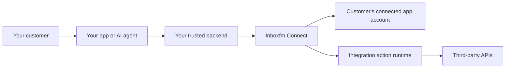

# Inboxfm Connect

[](https://github.com/Mihir-Rabari/inboxfm-connect/actions/workflows/ci.yml)
[](CONTRIBUTING.md)

**Integration infrastructure for AI agents and SaaS products.** Let your customers connect their apps, discover available tools, and execute actions on their behalf through REST, MCP, and a TypeScript SDK.

The product direction is a self-hostable developer platform in the same category as [Pipedream Connect](https://pipedream.com/docs/connect): your application owns the user experience and agent logic; Inboxfm Connect supplies account connections, credential handling, and integration execution. Read the [product direction and research report](docs/PRODUCT_DIRECTION.md) for the evidence, roadmap, and current gaps.

Inboxfm Connect is an independent fork of [Activepieces](https://github.com/activepieces/activepieces). It builds on the upstream integration ecosystem and replaces the visual flow builder with a headless application. See [upstream credits](UPSTREAM_CREDITS.md). This fork is not affiliated with or endorsed by Activepieces.

**Development preview:** use it for local experiments and hackathon projects. Production hardening and removal of inherited Enterprise dependencies are still tracked work. The repository contains both MIT and Enterprise-licensed material; see [licensing](LICENSING.md) before deploying or redistributing it.

## The experience we are building

1. Your customer signs into **your application**.
2. Your backend creates a short-lived Connect session for that customer's `externalUserId` and allowed integrations.
3. Your application opens the returned connection URL; the customer authorizes their third-party account.
4. Your backend discovers tools and executes an action using that customer's connection.
5. Your application or agent presents the result and lets the customer reconnect or revoke access.



Connect API keys stay on your backend. Derive `externalUserId` from your authenticated customer session; do not trust an arbitrary ID submitted by the browser. A project API key is privileged access to that project, not authentication for an individual customer.

## Available building blocks

- Hosted connection pages reached through short-lived end-user sessions, plus project-scoped API keys.
- Tool discovery and execution across the inherited integration catalog.
- MCP servers that expose integrations and tables to compatible AI clients.
- Applications that use structured tables, scheduled tasks, and trigger bindings.
- An operator dashboard for integrations, connections, MCP servers, and API keys.

These building blocks exist in the repository; they do not establish production parity with Pipedream Connect. A general credential-aware API proxy, a published SDK installation path, and a verified external-user OAuth/MCP journey remain delivery work. The dashboard is the management surface; the embedded integration experience is the main product.

The catalog contains hundreds of inherited integration packages. Package count is not a promise that every provider, action, or OAuth flow is configured and verified on your deployment. Operators must register/configure their OAuth applications, callback URLs, and required provider permissions; upstream OAuth approvals are not transferred by forking the code.

Third-party integrations may require an account, credentials, or a paid service. Use sandbox accounts and test data for demos.

## Start locally

Use **Node.js 24** and **Bun 1.3.3** (pinned in `package.json`). Linux, macOS, or WSL2 is recommended for the native dependencies and shell-based test commands. Native dependency builds may require Python and a C/C++ toolchain.

```bash
git clone https://github.com/Mihir-Rabari/inboxfm-connect.git
cd inboxfm-connect
git switch dev
npm start
```

`npm start` installs dependencies, builds the configured development integrations, and starts the backend and engine. In another terminal, start the web application:

```bash
bun x turbo run serve --filter=@inboxfm-connect/web
```

Open [localhost:4200](http://localhost:4200). The API listens on port 3000. See [the hackathon guide](docs/HACKATHON.md) for environment settings, credentials, sample projects, and troubleshooting. Subsequent backend starts use `npm run dev`.

## SDK and API

The SDK source and runnable examples live in [packages/connect-sdk](packages/connect-sdk). Its [README](packages/connect-sdk/README.md) covers the local workspace/tarball installation path, authentication, connection sessions, tool discovery, and action execution; the [SDK overview](docs/connect-sdk/overview.mdx) and [reference](docs/connect-sdk/reference.mdx) cover the public contract. Public npm availability is not assumed: the registry lookup returned 404 during the September 27, 2026 review.

The following runs on your backend after installing the SDK from the repository. Configure a Connect API key, project ID, and the provider's OAuth app before using an OAuth integration.

```ts
import { InboxFM } from '@inboxfm-connect/sdk'

const inboxfm = new InboxFM({
  baseUrl: 'http://localhost:3000/api',
  projectId: 'YOUR_PROJECT_ID',
  apiKey: 'YOUR_SERVER_SIDE_CONNECT_API_KEY',
})

// Use the customer identity established by your application's authentication.
const externalUserId = 'customer_42'
const integration = '@inboxfm-connect/piece-slack'
const session = await inboxfm.createConnectSession({
  externalUserId,
  allowedPieceNames: [integration],
})
// Send session.connectUrl to this customer's browser to authorize Slack.

const tools = await inboxfm.listTools({
  integration,
})

// After the customer connects, resolve their connection within this project.
const connections = await inboxfm.listConnections({ externalUserId, pieceName: integration })
// Choose a returned connection and a tool from tools; use the tool's input schema.
const connection = connections.data.find((candidate) => candidate.status === 'ACTIVE')
if (!connection) throw new Error('Connect or reconnect this customer\'s Slack account first')

const output = await inboxfm.execute({
  integration,
  tool: 'send_channel_message',
  connectionId: connection.id,
  input: { channel: 'YOUR_CHANNEL_ID', text: 'Hello from your app', sendAsBot: true },
})
```

The session creation and the later execution are separate steps: wait for the customer's connection flow to complete before listing their connections and sending the message. Keep API keys on the server. The placeholders are not credentials; never commit real credentials or expose them in a browser bundle.

## Repository map

| Area | Location |
| --- | --- |
| REST API, tenant security, persistence | [packages/server/api](packages/server/api) |
| Headless runtime and engine | [packages/runtime](packages/runtime), [packages/server/engine](packages/server/engine) |
| Sandbox and server utilities | [packages/server/sandbox](packages/server/sandbox), [packages/server/utils](packages/server/utils) |
| Thin core libraries and application schemas | [packages/core](packages/core) |
| Integration framework and catalog | [packages/integrations](packages/integrations) |
| Dashboard | [packages/web](packages/web) |
| TypeScript client | [packages/connect-sdk](packages/connect-sdk) |
| Scheduling | [packages/scheduler](packages/scheduler) |
| Inherited restricted code | `packages/ee/`, `packages/server/api/src/app/ee/` |

Read [ARCHITECTURE.md](ARCHITECTURE.md) for execution flows, package boundaries, storage, and where to make changes.

## Contribute

Branch from `dev` and open your PR against **`dev`**. `main` receives reviewed promotions from `dev`. Check existing issues and PRs before starting, keep each change focused, and include its issue number.

Start with [CONTRIBUTING.md](CONTRIBUTING.md), [the hackathon guide](docs/HACKATHON.md), and [open issues](https://github.com/Mihir-Rabari/inboxfm-connect/issues). Follow the [Code of Conduct](.github/CODE_OF_CONDUCT.md). Report vulnerabilities privately through [SECURITY.md](SECURITY.md).

## Checks

```bash
npm run lint-dev
npm run test-unit
npm run test-api
npm run check-migrations
npm run check-licenses
```

CI runs on every PR, pushes to `dev` and `main`, and merge queues. It checks workflow syntax, attribution and Enterprise boundaries, lint, types, builds, SDK packaging, unit/web tests, edition integration tests, PostgreSQL behavior, migrations, and affected integrations. See [docs/CI.md](docs/CI.md) for the exact jobs and local commands.

The required Chromium, Firefox, and WebKit journey covers dashboard sign-in, persisted automation setup, and real Text Helper execution. It is separate from the external-customer OAuth acceptance journey described in the [product roadmap](docs/PRODUCT_DIRECTION.md#recommended-delivery-order).

## License and attribution

Keep the original copyright and license notices. Most application code is covered by the [root license](LICENSE), which explicitly excludes the two Enterprise directories and preserves third-party license terms. Those Enterprise directories are governed by [Activepieces' Enterprise license](packages/ee/LICENSE); tests passing or choosing an edition does not grant additional license rights.

See [LICENSING.md](LICENSING.md) for the current limitations and [UPSTREAM_CREDITS.md](UPSTREAM_CREDITS.md) for acknowledgements.
